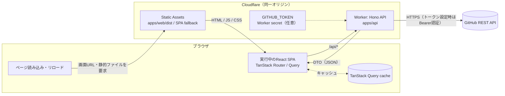

# Commit Quest

GitHubのコミット情報を取得し、RPG風のUIで可視化するMVPです。

## 全体構成



- ブラウザのリクエストは同一オリジンで受け付ける。`/api/*` は Worker の Hono が処理し、画面URLや静的ファイルは Static Assets が配信する。画面URLに対応するファイルがない場合は SPA fallback で `index.html` を返す（`run_worker_first: ["/api/*"]`）。
- GitHub REST API へのアクセスは Worker 経由で行う。設定した GitHub Token は Worker secret としてサーバー側にのみ保持する。
- API は GitHub の生レスポンスを DTO に変換して返すため、UI は GitHub のレスポンス形式を知らない。`packages/types` は Web と API がビルド時に参照する共通型であり、実行時の通信先ではない。
- 取得したデータは TanStack Query がブラウザ側でキャッシュし、Repository Detail / Commit Detail では Router の loader から事前取得する。

| 画面 | Route | 呼び出す API（Worker） | GitHub REST API |
| --- | --- | --- | --- |
| Home | `/` | なし | なし |
| Player Dashboard（World Map） | `/users/$username` | `/api/github/users/:username`<br/>`/api/github/users/:username/repos`<br/>`/api/github/users/:username/stats` | `GET /users/{username}`<br/>`GET /users/{username}/repos`<br/>`GET /search/commits` |
| Repository Detail | `/users/$username/repos/$owner/$repo` | `/api/github/repos/:owner/:repo`<br/>`/api/github/repos/:owner/:repo/commits`<br/>`/api/github/repos/:owner/:repo/contributors` | `GET /repos/{owner}/{repo}`<br/>`GET /repos/{owner}/{repo}/commits?per_page=1&author={username}`（コミット数）<br/>`GET /repos/{owner}/{repo}/commits`（一覧）<br/>`GET /repos/{owner}/{repo}/contributors` |
| Commit Detail | `/users/$username/repos/$owner/$repo/commits/$sha` | `/api/github/repos/:owner/:repo/commits/:sha` | `GET /repos/{owner}/{repo}/commits/{sha}` |

## なぜこの技術構成にしたか

React 19 / TypeScript / Vite 6 / TanStack Router / TanStack Query / Tailwind CSS 4 / Hono / Cloudflare Workers / Turborepo / pnpm / GitHub REST API という技術スタックを、小規模でも一通り動くアプリケーションとして実際に使い、以下を経験・説明できる状態にするため。

- APIから取得したServer StateをTanStack Queryで管理した経験
- SPAのルーティングをTanStack Routerで型安全に構築した経験
- Tailwind CSS 4でRPG風の独自UIを構築した経験
- TurborepoでWeb/API/共通型をモノレポ管理した経験
- 抽象的な「RPGっぽいUI」を具体的な画面・挙動へ落とし込んだ経験

### Why TanStack Query

API由来のServer StateをReactのローカルstateから分離し、fetch/cache/refetch/error/loadingを宣言的に管理するため。`staleTime` によるキャッシュ共有により、同じデータへ戻ったときの再取得待ちを減らせます。

### Why TanStack Router

SPAのルーティングとURL state（username / owner / repo / sha / page）をTypeScriptで型安全に管理するため。File-based routingによりRoute構造がディレクトリ構造から把握しやすくなります。

### Why Tailwind CSS

UIコンポーネント単位で高速にスタイルを構築し、RPGのコマンドウィンドウ風という独自UIを実装するため。CSS-first configuration（`@theme`）でデザイントークンをCSS側に閉じ込めています。

### Why Turborepo

Web / API / 共通型（packages/types）を1リポジトリで管理し、複数package間の依存関係とbuild/lint/typecheckタスクを整理するため。

## Architecture

```text
commit-quest/
├─ apps/
│  ├─ web/    React 19 + Vite 6 + TanStack Router/Query + Tailwind CSS 4 (SPA)
│  └─ api/    Hono on Cloudflare Workers (GitHub REST APIラッパー)
├─ packages/
│  ├─ types/  API DTO（apps/web・apps/apiで共有）
│  ├─ ui/     RPG風共通UIコンポーネント（RpgPanel / RpgButton / XpBar など）
│  └─ config/ 共通tsconfig / eslint設定
```

### Cloudflare Workers統合デプロイ構成

本番では `apps/web` のビルド成果物（`apps/web/dist`）を、`apps/api` の同一Workerが **Static Assets** としてそのまま配信します。

- `apps/api/wrangler.jsonc` の `assets.directory` が `../web/dist` を指す
- `assets.not_found_handling: "single-page-application"` により、`/users/octocat` のような深いURLへの直アクセス・リロードでも `index.html` が返り、TanStack Router側でルーティングされる（SPA fallback）
- `assets.run_worker_first: ["/api/*"]` により、`/api/*` 配下のリクエストのみ先にWorker（Hono）が処理し、それ以外は静的アセット配信が優先される
- つまり **WebとAPIは同一オリジン・同一Workerとしてデプロイされ**、Web側は相対パス `/api/...` でバックエンドへアクセスする（CORS設定が不要）

## Setup

Node.js 22以上が必要です。pnpmのバージョンはルートの`package.json`で固定しています。

```bash
corepack enable
pnpm install
```

GitHub APIへの認証なしアクセスは60 req/h（IP単位）に制限されます。ローカル開発でレート制限に当たりやすい場合は、`apps/api/.dev.vars` にfine-grained PAT（public repository read-only権限で十分）を設定してください。未設定でも動作します。

```env
# apps/api/.dev.vars
GITHUB_TOKEN=github_pat_xxxxxxxx
```

## 起動方法

```bash
pnpm dev
```

- Web: http://localhost:5173 （Vite dev server。`/api` を8787へproxy）
- API: http://localhost:8787 （`wrangler dev`。Hono on Workers）

## Environment Variables

### apps/api

| 変数           | 用途                                                      | 必須 |
| -------------- | ----------------------------------------------------------- | ---- |
| `GITHUB_TOKEN` | GitHub REST APIへのリクエストに使用するfine-grained PAT。未設定でも動作するが、レート制限が60 req/hに制限される | 任意 |

GitHub Tokenは`apps/api`（サーバー側）にのみ保持され、Web（ブラウザ）へは一切渡りません。

### apps/web

ビルド後は同一Workerから配信されるため、`VITE_API_BASE_URL` のような環境変数は不要です（`/api` への相対パスでアクセスします）。

## MVP Scope

- GitHub username入力 → Player Dashboard（World Map表示を含む） / Repository Detail / Commit Detail
- RPGメタファー（Level / XP / Quest / QUEST CLEAR!）
- Loading（Loading Quest...） / Error（QUEST FAILED） / Empty（NO QUESTS FOUND）状態
- GitHub TokenをAPI側にのみ保持
- TanStack QueryによるServer State管理とキャッシュ

## 現在の実装で工夫した点

- Repository一覧はGitHubへ1回だけ問い合わせる。コミット数はRepository Detailを開いたときに取得し、一覧取得時のN+1リクエストを避ける。
- DashboardのQuest XPは、GitHub Search APIで取得した対象ユーザーのコミット検索結果数を基に計算する。Repository DetailのPartyはcontributors APIから取得し、Botと既知のAIエージェントのアカウントを除外する。Quest XPとLevelはCommit Quest独自の指標である。
- World MapはDashboardに統合した。ノード選択後にキャラクターが移動し、Command Windowの「冒険する」からRepository Detailへ進む。GitHubデータはTanStack Query、URLはTanStack Router、キャラクター位置などの画面内状態はReact Stateで管理する。戻る操作では訪問先の位置をContextから復元し、リロード時はHOMEへ戻る。
- Repository DetailのloaderはRepository情報・Commit一覧・contributorsを並行取得し、Commit Detailのloaderは対象Commitを取得する。両画面はQuery Cacheを利用し、World MapのCommand Window表示時にはRepository Detailを先読みする。

改善前の課題と検討経緯は[改善提案書](docs/improvement-proposal.md)にまとめている。

## 想定しているプロダクト像（本MVPの先）

募集要項の「エンジニアチームの状態をRPG風に可視化するチーム分析プロダクト」を踏まえると、本来は**GitHub Organization単位**でチームの活動を可視化するプロダクトを想定している。

- HOME: Organizationの全リポジトリを合計した、**メンバー別**のPlayer Status（パーティー編成のような一覧）
- World Map: Organization配下のリポジトリ一覧
- Repository Detail: 現状と同じく、リポジトリ単位のメンバー別貢献度

想定するAPIは`GET /orgs/{org}/repos`でリポジトリ一覧を取得し、各リポジトリの`GET /repos/{owner}/{repo}/contributors`（期間を区切るなら`GET /repos/{owner}/{repo}/stats/contributors`）でメンバー別貢献度を集計する形になる。ただしOrganization全体の集計はリポジトリ数分の呼び出しが必要になり、この構成のままではN+1になってしまうため、集計結果はCloudflare Cache（KVまたはCache API）にキャッシュし、一定時間はGitHubへ再問い合わせしない設計にしたい。

本MVPでは対象をuser（個人）に絞り、その中でも「HOMEでの合計」「Repository単位でのメンバー貢献度」という同じ構造を先に作った。今回追加したユーザー単位の集計（`/users/:username/stats`）とリポジトリのcontributors（`/repos/:owner/:repo/contributors`）は、対象をuserからorgに差し替えるだけで拡張できる形を意識している。

## Future Work

- Dashboard（World Map）の複数ページ対応（現状は取得可能な最初の1ページのみで表示）
- GitHub OAuthによるログインとprivate repositoryの閲覧
- Commit差分（diff）の表示
- E2Eテストの追加（現状はPlaywright MCPによる手動確認のみ）
- Cloudflare Cacheの導入（`docs/improvement-proposal.md` Priority 5、Organization単位の集計キャッシュにも同じ仕組みを使う想定）
- GitHub Organization単位でのチーム分析（メンバー別Player Status、リポジトリ別貢献度）への拡張

## 既知の制約

- Repository DetailのPartyはcontributors APIの最初の30件のみ表示する。
- `apps/web/src/routeTree.gen.ts` は TanStack Router の vite plugin（`@tanstack/router-plugin/vite`）が自動生成するファイルです。クローン直後でも typecheck が通るよう Git 管理に含めています。手で編集しないでください。
- GitHub APIの認証なしレート制限（60 req/h）に達すると、画面には `QUEST FAILED` として日本語の案内メッセージが表示されます（GitHubの生エラー文はそのまま表示しません）。
